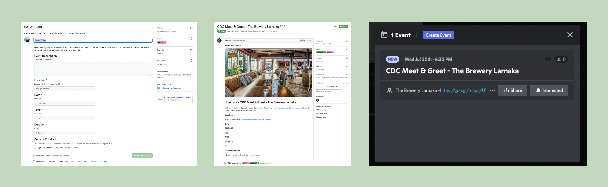

# GitEvents Propaganda Action

<p align="center">
  
</p>

## How it works

1. Create a new Issue with the Event Form (check out the [CDC.cy example](https://github.com/cyprus-developer-community/events/blob/main/.github/ISSUE_TEMPLATE/event.yml))
2. Approve the Event on your Issue tracker
3. Let the :robot: work its :magic_wand:

## Features

### Discord Events

This is done via a [reusable GitHub Action](https://docs.github.com/en/actions/using-workflows/reusing-workflows#using-inputs-and-secrets-in-a-reusable-workflow) and OpenID Connect Authentication ([OICD](https://docs.github.com/en/actions/deployment/security-hardening-your-deployments/using-openid-connect-with-reusable-workflows)).

1. [Add the Discord Bot to your Server](https://discord.com/api/oauth2/authorize?client_id=989117237619208233&scope=bot&permissions=8589953024)
2. Get your Server/Guild ID ("Copy ID" when Developer Mode is active in the Discord Client)
3. Copy the workflow below into your events repo (ie. `.github/workflows/gitevents-discord.yml`), see [example](https://github.com/cyprus-developer-community/events/blob/main/.github/workflows/gitevents-discord.yml)
4. Change the server-id and your default time-zone
5. Commit and push to your events repo

```
name: Create Events on Discord

on:
  issues:
    types: [labeled]

jobs:
  reuse:
    if: contains( github.event.issue.labels.*.name, 'Approved' )
    uses: gitevents/propaganda/.github/workflows/discord-event.yml@main
    with:
      server-id: "983632632514498621"
      time-zone: 'Europe/Nicosia'
```

### OpenCollective Events

coming soon

### Twitter Reminders

coming soon

### Facebook Events

coming soon

## License

Licensed under [MIT](./LICENSE).
